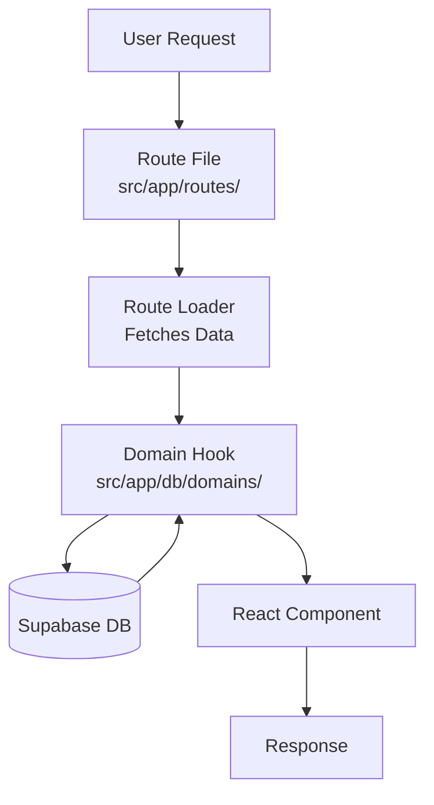

# Architecture

## Request Flow



Routes use loaders to fetch data via domain hooks, which access Supabase.

## File-Based Routing

Routes live in `src/app/routes/`. File structure maps to URLs:

- `index.tsx` → `/`
- `about.tsx` → `/about`
- `auth/login.tsx` → `/auth/login`
- `users/$userId.tsx` → `/users/:userId`

Route tree auto-generates: [`src/app/routeTree.gen.ts`](../src/app/routeTree.gen.ts)

## Path Aliases

Configured in [`tsconfig.json`](../tsconfig.json):

- `@db/core` → `src/app/db/core/index.ts` (DB client, types)
- `@db/*` → `src/app/db/domains/*` (domain hooks)
- `@app/*` → `src/app/*` (app code)
- `@data/*` → `src/data/*` (Zod schemas)

## Directory Structure

```
src/
├── app/
│   ├── routes/          # File-based routes
│   ├── db/
│   │   ├── core/        # DB client, generated types
│   │   └── domains/     # Domain-specific hooks
│   ├── components/      # Reusable UI components
│   └── lib/             # Utilities
└── data/                # Zod schemas
```

## How Things Come Together

**Example: Loading factions on home page**

1. Route: [`src/app/routes/index.tsx`](../src/app/routes/index.tsx)
   ```typescript
   loader: async () => {
     const { data: factions } = await db.from('factions').select();
     return { factions };
   }
   ```

2. Domain hook: [`src/app/db/domains/factions.ts`](../src/app/db/domains/factions.ts)
   ```typescript
   export function useFactionsAll() {
     return useQuery({
       queryKey: factionKeys.list({ type: 'all' }),
       queryFn: async () => { ... }
     });
   }
   ```

3. Database: Supabase PostgreSQL with Row Level Security

## Framework Stack

- **TanStack Start** - Full-stack React framework
- **TanStack Router** - Type-safe routing
- **TanStack Query** - Server state management
- **Supabase** - PostgreSQL + Auth
- **Vite** - Build tool
- **React 19** - UI library

## Common Tasks

### Adding a New Route

Create file in `src/app/routes/`:
```typescript
import { createFileRoute } from '@tanstack/react-router';

export const Route = createFileRoute('/path')({
  component: Component,
  loader: async () => {
    // Fetch data
  },
});
```

### Adding a New Domain

1. Schema: `src/data/domain.ts` (Zod)
2. Domain: `src/app/db/domains/domain.ts` (hooks)
3. Sync: `npm run db:schemas` (generates migration)
4. Types: `npm run db:types` (generates TypeScript types)

See [Data Layer](./data-layer.md) for domain file structure.
