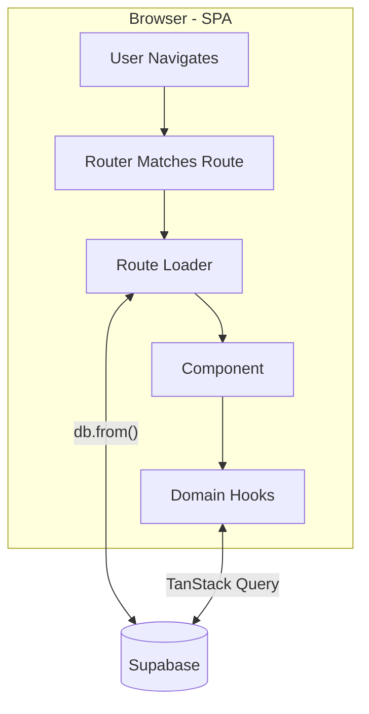

# Architecture

## Request Flow (SPA - all client-side)

Loaders fetch directly via `db.from()`. Components use domain hooks (TanStack Query) for reactive/mutating data. Everything runs in the browser - no server rendering.

## File-Based Routing

Routes live in `src/app/routes/`. File structure maps to URLs (e.g. `index.tsx` → `/`, `auth/login.tsx` → `/auth/login`). Route tree auto-generates: [`src/app/routeTree.gen.ts`](../src/app/routeTree.gen.ts)

## Path Aliases

Configured in [`tsconfig.json`](../tsconfig.json):

- `@db/core` → `src/app/db/core/index.ts` (DB client, types)
- `@db/*` → `src/app/db/domains/*` (domain hooks)
- `@app/*` → `src/app/*` (app code)
- `@data/*` → `src/data/*` (Zod schemas)

## How Things Come Together

**Example: Loading factions on home page**

1. Route [`src/app/routes/index.tsx`](../src/app/routes/index.tsx) - loader fetches from DB
2. Domain hook [`src/app/db/domains/factions.ts`](../src/app/db/domains/factions.ts) - `useFactionsAll()` wraps TanStack Query
3. Database - Supabase PostgreSQL with Row Level Security

See [README](./README.md) for workflows.
