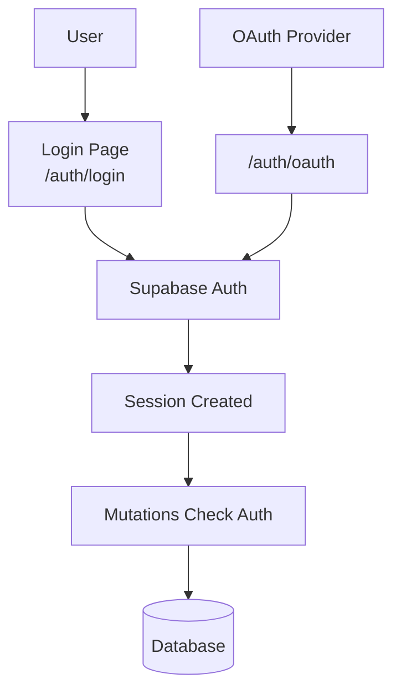

# Authentication

## Auth Flow



Supabase Auth handles authentication. Mutations check auth before database operations.

## Supabase Auth

**Client**: [`src/app/db/core/index.ts`](../src/app/db/core/index.ts#L11)

```typescript
export const auth = db.auth;
```

## Authentication in Mutations

Check auth before mutations:

```typescript
const user = await auth.getUser();
if (!user.data.user?.id) throw new Error('Not authenticated');
```

**Examples**:
- [`src/app/db/domains/factions.ts`](../src/app/db/domains/factions.ts#L156-L157)
- [`src/app/db/domains/groups.ts`](../src/app/db/domains/groups.ts#L101-L102)

## Auth Routes

Routes in `src/app/routes/auth/`:

- `login.tsx` → `/auth/login` - Login form
- `oauth.tsx` → `/auth/oauth` - OAuth callback handler
- `error.tsx` → `/auth/error` - Auth error page
- `index.tsx` → `/auth` - Auth landing

## Login Form

**Component**: [`src/app/components/login-form.tsx`](../src/app/components/login-form.tsx)

Reusable login form component used in auth routes.

## User ID in Database Operations

Use `user.data.user.id` for user identification:

```typescript
const user = await auth.getUser();
const userId = user.data.user?.id;
```

**Examples**:
- [`src/app/db/domains/factions.ts`](../src/app/db/domains/factions.ts#L164)
- [`src/app/db/domains/groups.ts`](../src/app/db/domains/groups.ts#L107)

## Profiles

Profiles are automatically created when a user signs up via database trigger.

**Trigger**: `handle_new_user()` runs after INSERT on `auth.users`

**Creates profile with**:
- `id` = auth user `id` (foreign key to `auth.users`)
- `username` = `raw_user_meta_data->>'full_name'` or email
- `avatar_url` = `raw_user_meta_data->>'avatar_url'`

**Profile table**: `profiles` (id, username, avatar_url, created_at, updated_at)

**Hooks**:
- `useCurrentProfile()` - Get current user's profile
- `useProfile(id)` - Get profile by ID
- `useUpdateCurrentProfile()` - Update current user's profile

**Example**: [`src/app/db/domains/profiles.ts`](../src/app/db/domains/profiles.ts)

**Migration**: [`supabase/migrations/20260310195725_remote_schema.sql`](../supabase/migrations/20260310195725_remote_schema.sql#L107-L124)
