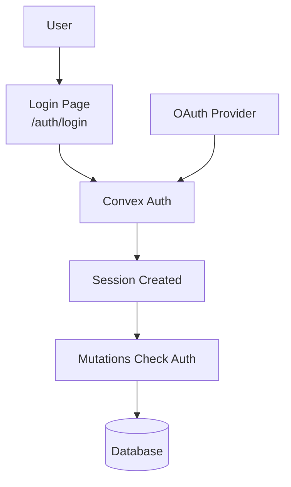

# Authentication

## Auth Flow



Convex Auth handles authentication. Domain mutations enforce authorization inside Convex functions.

## Convex Auth

**Client**: [`src/app/db/core/index.ts`](../src/app/db/core/index.ts)

```typescript
export const convex = new ConvexReactClient(import.meta.env.VITE_CONVEX_URL!);
```

## Authentication in Mutations

Auth is enforced server-side in Convex mutations:

```typescript
const userId = await requireAuthUserId(ctx);
```

**Examples**: [`src/app/db/domains/factions.ts`](../src/app/db/domains/factions.ts), [`src/app/db/domains/groups.ts`](../src/app/db/domains/groups.ts)

## Auth Routes

Routes in `src/app/routes/auth/`:

- `login.tsx` → `/auth/login` - Login form
- `oauth.tsx` → `/auth/oauth` - Legacy compatibility redirect
- `error.tsx` → `/auth/error` - Auth error page
- `index.tsx` → `/auth` - Auth landing

## Profiles

Profiles are created on first authenticated bootstrap/update mutation in Convex.

**Hooks**: `useCurrentProfile()`, `useProfile(id)`, `useUpdateCurrentProfile()`

**Example**: [`src/app/db/domains/profiles.ts`](../src/app/db/domains/profiles.ts)
