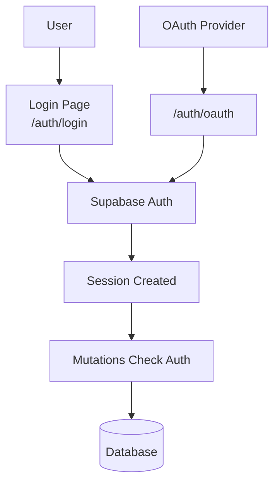

# Authentication

## Auth Flow



Supabase Auth handles authentication. Mutations check auth before database operations.

## Supabase Auth

**Client**: [`src/app/db/core/index.ts`](../src/app/db/core/index.ts)

```typescript
export const auth = db.auth;
```

## Authentication in Mutations

Check auth before mutations:

```typescript
const user = await auth.getUser();
if (!user.data.user?.id) throw new Error('Not authenticated');
```

**Examples**: [`src/app/db/domains/factions.ts`](../src/app/db/domains/factions.ts), [`src/app/db/domains/groups.ts`](../src/app/db/domains/groups.ts)

## Auth Routes

Routes in `src/app/routes/auth/`:

- `login.tsx` → `/auth/login` - Login form
- `oauth.tsx` → `/auth/oauth` - OAuth callback handler
- `error.tsx` → `/auth/error` - Auth error page
- `index.tsx` → `/auth` - Auth landing

## Profiles

Profiles are automatically created when a user signs up via database trigger (`handle_new_user()` after INSERT on `auth.users`).

**Hooks**: `useCurrentProfile()`, `useProfile(id)`, `useUpdateCurrentProfile()`

**Example**: [`src/app/db/domains/profiles.ts`](../src/app/db/domains/profiles.ts)
