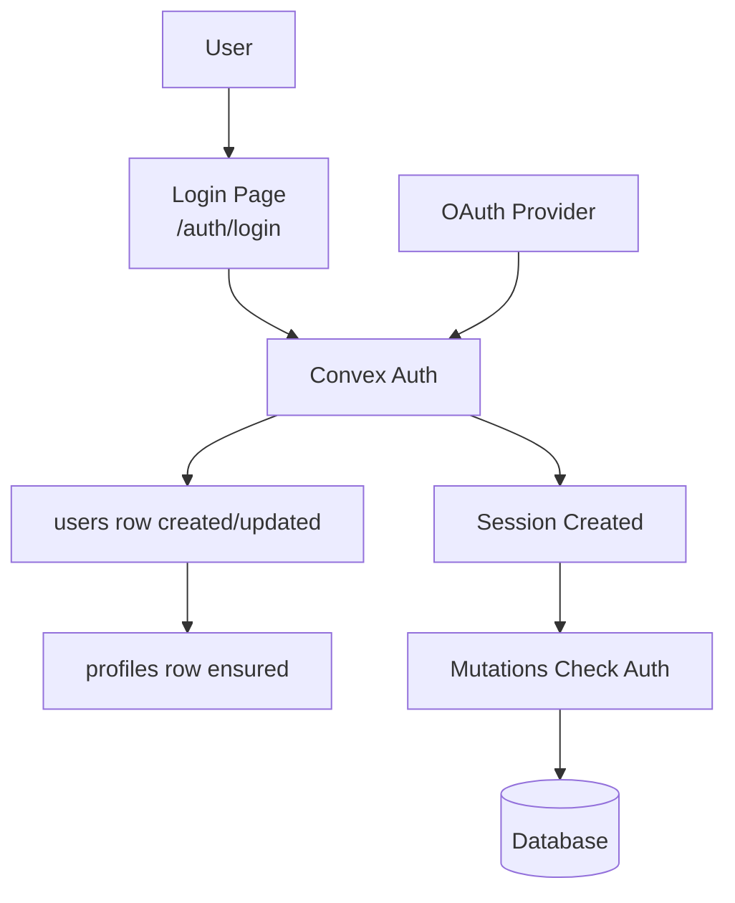

# Authentication

## Auth Flow



Convex Auth handles authentication. Domain mutations enforce authorization inside Convex functions.

## Convex Auth

**Client**: [`src/app/db/core/index.ts`](../src/app/db/core/index.ts)

```typescript
export const convex = new ConvexReactClient(import.meta.env.VITE_CONVEX_URL!);
```

## Authentication in Mutations

Auth is enforced server-side in Convex mutations:

```typescript
const userId = await requireAuthUserId(ctx);
```

**Examples**: [`src/app/factions/db.ts`](../src/app/factions/db.ts), [`src/app/groups/db.ts`](../src/app/groups/db.ts)

## Auth Routes

Routes in `src/app/routes/auth/`:

- `login.tsx` → `/auth/login` - Login form
- `oauth.tsx` → `/auth/oauth` - Legacy compatibility redirect
- `error.tsx` → `/auth/error` - Auth error page
- `index.tsx` → `/auth` - Auth landing

## Profiles

A `profiles` document is created in Convex when an auth user is created or updated: `callbacks.afterUserCreatedOrUpdated` in [`convex/auth.ts`](../convex/auth.ts) calls `ensureProfileForUser` (see [`convex/lib/profileBootstrap.ts`](../convex/lib/profileBootstrap.ts)) using the patched `users` row (`name`, `image`).

If a legacy user has no profile, the client’s `useCurrentProfile()` calls `profiles.bootstrapCurrent` once when `currentUserId` is set and `profiles.current` is still `null`. For bulk repair, missing profiles are backfilled by the **`profiles_from_users_v1`** Convex migration (see [`convex/migrations.ts`](../convex/migrations.ts)), which runs with the rest of the widen migrations via `bun run migrations:deploy` / `bun run migrations:dev-strict` and appears on [`/admin/migrations`](../src/app/routes/_app/admin/migrations.tsx).

**Hooks**: `useCurrentProfile()`, `useProfile(id)`, `useUpdateCurrentProfile()`

**Example**: [`src/app/profile/db.ts`](../src/app/profile/db.ts)
