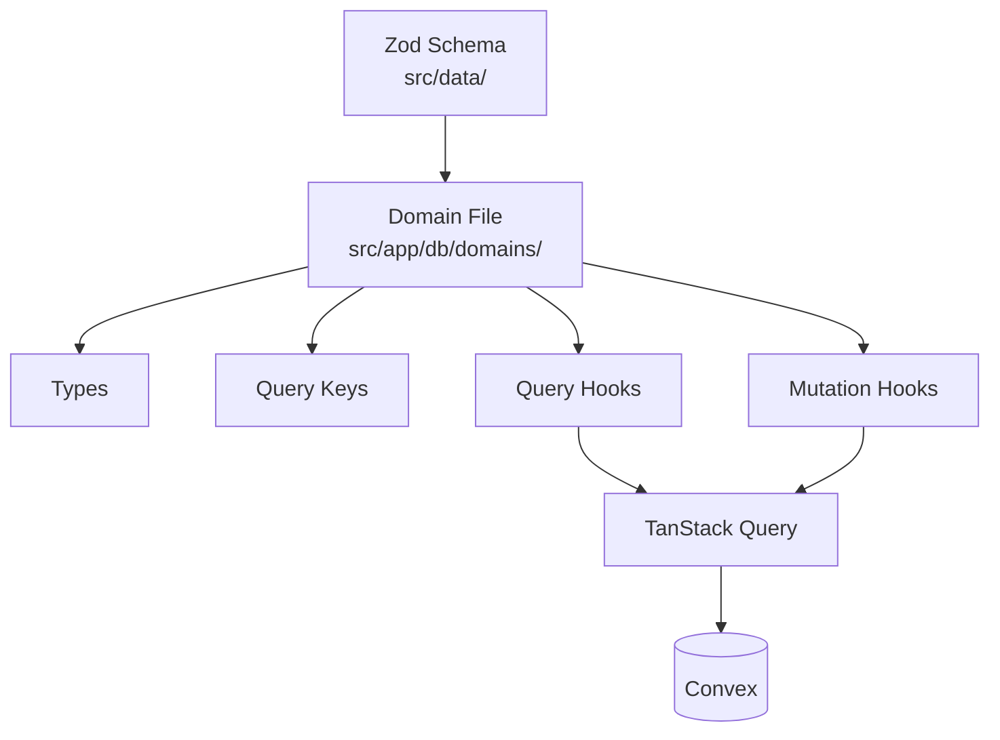

# Data Layer

## Domain File Structure



Each domain file follows this structure: types → query keys → queries → mutations.

## Convex Schema

Convex schema and indexes are defined in [`convex/schema.ts`](../convex/schema.ts). Domain-level validation still uses Zod schemas in `src/data/`.

## Basic DB Structure

**Tables**: factions, groups, group_members, profiles

**Pattern**: Domain data is stored in Convex documents, validated with Zod in domain hooks and with function validators in Convex functions. Factions and rulesets use soft delete; groups use hard delete.

## Domain File Pattern

### 1. Types

Wrap database types with domain types:

```typescript
export type FactionEntry = Omit<Tables<'factions'>, 'data'> & {
  data: Faction;  // Validated Zod type
};
```

### 2. Query Keys

Hierarchical structure for cache invalidation:

```typescript
export const domainKeys = {
  all: ['domain'] as const,
  lists: () => [...domainKeys.all, 'list'] as const,
  list: (filters: object) => [...domainKeys.lists(), filters] as const,
  detail: (id: string) => [...domainKeys.all, 'detail', id] as const,
};
```

**Example**: [`src/app/db/domains/factions.ts`](../src/app/db/domains/factions.ts)

## Data Validation

Zod schemas in `src/data/` validate at runtime:

- Before database operations (mutations)
- After database reads (queries)
- Type inference: `type Faction = z.infer<typeof schema>`

**Example**: [`src/data/factions.ts`](../src/data/factions.ts)

## Validation Standard

Use a two-layer validation model for all mutations:

1. **Boundary validation (Convex `v`)** for argument shape/type.
2. **Semantic validation (shared Zod)** for business rules.

Both client and server should parse the same Zod schema, but server parsing is authoritative.
Client parsing is for UX only and must not be treated as security.

### Enforcement Order

1. Normalize raw inputs (trim, map optional fields, etc.).
2. Run `safeParse` using shared Zod schema.
3. On parse failure, map issues to a stable, user-facing error message.
4. Continue mutation logic only with parsed data.

### Convex Mutation Pattern

```typescript
export const updateSomething = mutation({
  args: {
    name: v.string(),
  },
  handler: async (ctx, args) => {
    const parsed = someSharedSchema.safeParse({
      name: args.name,
    });
    if (!parsed.success) {
      const msg = parsed.error.issues.map((i) => i.message).join(' ');
      throw new Error(msg || 'Invalid input');
    }

    const input = parsed.data;
    // mutation logic using validated `input`
  },
});
```

### Adoption Checklist

- Find duplicated manual checks in Convex handlers.
- Move those rules into shared Zod schemas.
- Parse the same schema in client and server.
- Keep Convex `v` validators at function boundaries.
- Keep validation error messages stable and user-friendly.

### Current Exemplars

- Shared profile semantic schema: [`src/app/profile/validation.ts`](../src/app/profile/validation.ts)
- Server-authoritative parse in mutation: [`convex/profiles.ts`](../convex/profiles.ts)

## Soft Delete Pattern

Factions and rulesets use `is_deleted` flags instead of hard deletes:

- Queries filter deleted rows in Convex query handlers
- Delete mutation sets `is_deleted: true`

**Example**: [`src/app/db/domains/factions.ts`](../src/app/db/domains/factions.ts)

Groups use hard delete (actual row removal).
