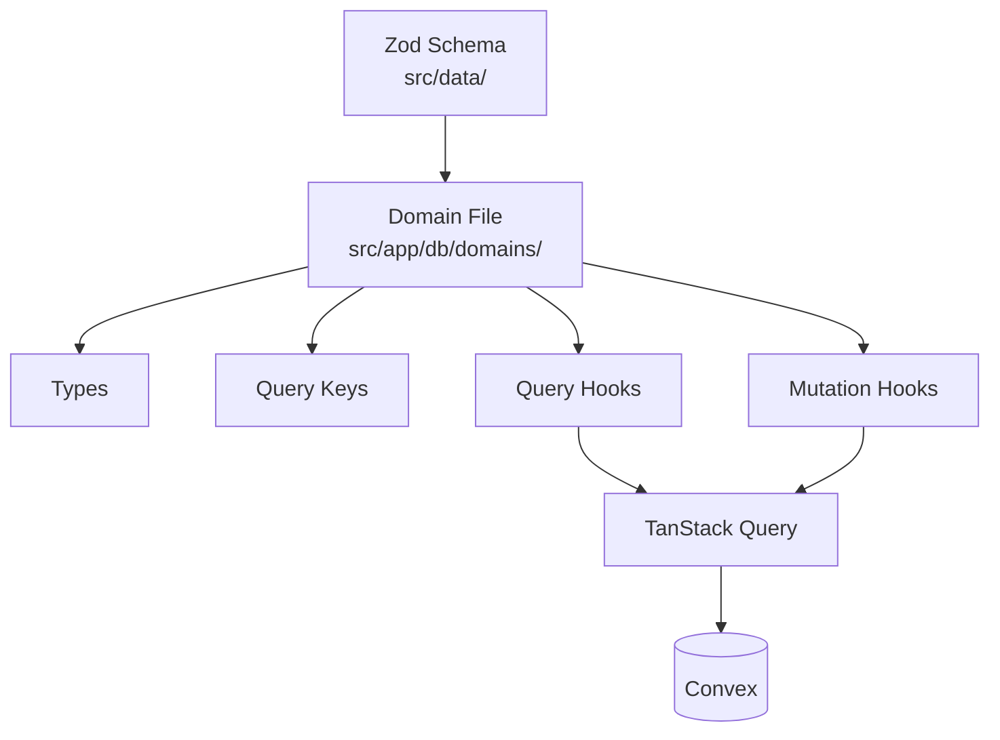

# Data Layer

## Domain File Structure



Each domain file follows this structure: types → query keys → queries → mutations.

## Convex Schema

Convex schema and indexes are defined in [`convex/schema.ts`](../convex/schema.ts). Domain-level validation still uses Zod schemas in `src/data/`.

## Basic DB Structure

**Tables**: factions, groups, group_members, profiles

**Pattern**: Domain data is stored in Convex documents, validated with Zod in domain hooks and with function validators in Convex functions. Factions and rulesets use soft delete; groups use hard delete.

## Domain File Pattern

### 1. Types

Wrap database types with domain types:

```typescript
export type FactionEntry = Omit<Tables<'factions'>, 'data'> & {
  data: Faction;  // Validated Zod type
};
```

### 2. Query Keys

Hierarchical structure for cache invalidation:

```typescript
export const domainKeys = {
  all: ['domain'] as const,
  lists: () => [...domainKeys.all, 'list'] as const,
  list: (filters: object) => [...domainKeys.lists(), filters] as const,
  detail: (id: string) => [...domainKeys.all, 'detail', id] as const,
};
```

**Example**: [`src/app/db/domains/factions.ts`](../src/app/db/domains/factions.ts)

## Data Validation

Zod schemas in `src/data/` validate at runtime:

- Before database operations (mutations)
- After database reads (queries)
- Type inference: `type Faction = z.infer<typeof schema>`

**Example**: [`src/data/factions.ts`](../src/data/factions.ts)

## Soft Delete Pattern

Factions and rulesets use `is_deleted` flags instead of hard deletes:

- Queries filter deleted rows in Convex query handlers
- Delete mutation sets `is_deleted: true`

**Example**: [`src/app/db/domains/factions.ts`](../src/app/db/domains/factions.ts)

Groups use hard delete (actual row removal).
