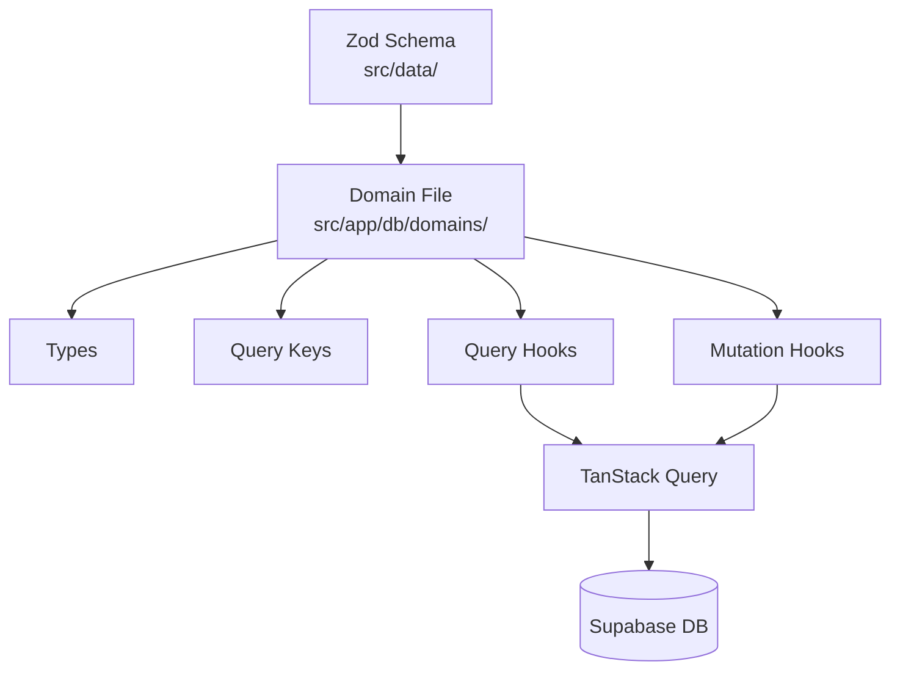

# Data Layer

## Domain File Structure



Each domain file follows this structure: types → query keys → queries → mutations.

## DB Syncing

Zod schemas in `src/data/` sync to database migrations.

**Command**: `npm run db:schemas`

**How it works**:
1. Scans `src/data/*.ts` for exported `schema` (ZodObject)
2. Converts to JSON Schema
3. Compares with existing migrations
4. Generates new migration if schema changed: `supabase/migrations/TIMESTAMP_domain_data_validation.sql`
5. Creates CHECK constraint using `pg_jsonschema` extension

**Script**: [`scripts/db-sync-data-schema.ts`](../scripts/db-sync-data-schema.ts)

**Workflow**:
```bash
# After changing a schema in src/data/
npm run db:schemas    # Generate migration
npm run db:push       # Apply to Supabase
npm run db:types      # Regenerate TypeScript types
```

## Basic DB Structure

**Tables**:
- `factions` - JSONB `data` column, soft delete (`is_deleted`)
- `groups` - Simple table, hard delete
- `group_members` - Status enum (pending/active/removed)
- `profiles` - User profiles linked to auth.users

**Pattern**: Domain data stored in JSONB `data` column, validated with Zod schemas.

**Type generation**: `npm run db:types` generates [`src/app/db/core/types.ts`](../src/app/db/core/types.ts) from Supabase schema.

## Domain File Pattern

### 1. Types

Wrap database types with domain types:

```typescript
export type FactionEntry = Omit<Tables<'factions'>, 'data'> & {
  data: Faction;  // Validated Zod type
};
```

### 2. Query Keys

Hierarchical structure for cache invalidation:

```typescript
export const domainKeys = {
  all: ['domain'] as const,
  lists: () => [...domainKeys.all, 'list'] as const,
  list: (filters: object) => [...domainKeys.lists(), filters] as const,
  detail: (id: string) => [...domainKeys.all, 'detail', id] as const,
};
```

**Example**: [`src/app/db/domains/factions.ts`](../src/app/db/domains/factions.ts#L25-L30)

### 3. Queries

Custom hooks with `initialData` optimization:

```typescript
export function useDomainDetail(id: string) {
  const qc = useQueryClient();
  return useQuery({
    queryKey: domainKeys.detail(id),
    queryFn: async () => { ... },
    initialData: () => 
      qc.getQueryData(domainKeys.list({}))?.find(d => d.id === id),
  });
}
```

**Example**: [`src/app/db/domains/factions.ts`](../src/app/db/domains/factions.ts#L34-L58)

### 4. Mutations

Cache updates on success:

```typescript
export function useCreateDomain() {
  const qc = useQueryClient();
  return useMutation({
    mutationFn: async (input) => {
      const validatedData = schema.parse(input);
      // Insert to DB
    },
    onSuccess: (data) => {
      qc.setQueryData(domainKeys.detail(data.id), data);
      qc.invalidateQueries({ queryKey: domainKeys.lists() });
    },
  });
}
```

**Example**: [`src/app/db/domains/factions.ts`](../src/app/db/domains/factions.ts#L151-L189)

## Data Validation

Zod schemas in `src/data/` validate at runtime:

- Before database operations (mutations)
- After database reads (queries)
- Type inference: `type Faction = z.infer<typeof schema>`

**Example**: [`src/data/factions.ts`](../src/data/factions.ts)

## Soft Delete Pattern

Factions use `is_deleted` flag instead of hard deletes:

- Queries filter: `.eq('is_deleted', false)`
- Delete mutation sets flag: `.update({ is_deleted: true })`

**Example**: [`src/app/db/domains/factions.ts`](../src/app/db/domains/factions.ts#L223-L238)

Groups use hard delete (actual row removal).

## Authentication in Mutations

Check auth before mutations:

```typescript
const user = await auth.getUser();
if (!user.data.user?.id) throw new Error('Not authenticated');
```

**Example**: [`src/app/db/domains/factions.ts`](../src/app/db/domains/factions.ts#L156-L157)
