# Deployment

## Current production and scheduled Worker release

The ordered `main` workflow deploys the already-provisioned unified Cloudflare Worker after Convex
and required migrations. The checked-in Worker release is persistently scheduled: both publisher
flags are `true` and exactly one `*/15 * * * *` Cron is source controlled. The Convex control plane
remains the durable execution authority.

**Release prerequisite: Convex publisher config and singleton must both be paused before this
scheduled Worker release is merged or deployed.** Deploying the Worker and Cron against paused
Convex must produce an empty poll, no Queue message, and no Browser Run. The workflow does not call
the operator endpoint or mutate publisher data; a separate explicitly approved operator action is
required to activate Convex later. Once that activation happens, ordinary `main` deploys preserve
the scheduled Worker configuration instead of reverting it to an inert release.

No workflow step changes `SITE_URL`, OAuth configuration, secrets, or infrastructure outside the
checked-in Worker bindings. The final Netlify publish is retained temporarily as the rollback build
and runs only after the Worker health smoke succeeds.

The later canonical-host cutover and publisher activation remain separately approved operations.
Cloudflare Git Builds stays disconnected so GitHub Actions remains the only ordered release
authority.

## Build Process

**Config**: [`netlify.toml`](../netlify.toml)
- **Default build command**: `bun run app:build`
- **Production override** (`[context.production]`): `bun run convex:deploy && bun run app:build` (legacy fallback when building directly in Netlify)
- **Publish directory**: `dist/client`

**Build configuration**: [`vite.config.ts`](../vite.config.ts)
- SPA mode enabled: `spa: { enabled: true }`
- Assets directory: `public`
- Public directory: `public`

**Unified Worker release build**:

```bash
VITE_CONVEX_URL=https://exuberant-finch-263.eu-west-1.convex.cloud bun run publisher:assets
```

This builds `dist/client`, builds the isolated publisher capture bundle, and assembles both into
`workers/publisher/dist`. The assembly omits Netlify-only `_redirects`, copies TanStack's
`_shell.html` to the `index.html` required by Cloudflare SPA fallback, and fails when the Workers
Free 20,000-file limit or 25 MiB per-file limit is exceeded.

## Routing and ownership

**Redirects file**: [`public/_redirects`](../public/_redirects)

Netlify rewrites missing routes to TanStack's SPA shell for client-side routing:

```
/*    /_shell.html   200
```

This ensures TanStack Router handles all routes on the client side.

Cloudflare Static Assets uses `not_found_handling: "single-page-application"`. Requests are
asset-first by default, so ordinary navigation and hashed static files avoid a Worker invocation.
Only these namespaces are Worker-first:

| Namespace | Owner |
| --- | --- |
| `/published` and `/published/*` | Stable public generated-asset delivery; malformed paths fail closed. |
| `/__asset-publisher` and `/__asset-publisher/*` | Health and capability-gated operational routes. |
| `/publisher-capture`, `/publisher-capture.html`, `/publisher-capture/*` | Capability-gated capture document and bundle. |
| Everything else, including `/factions/*` | Static asset lookup, then SPA `index.html` fallback. |

The faction-sheet delivery path is
`/published/factions/<Convex faction id>/sheet.pdf`. The `/published` prefix prevents collision with
the user-facing `/factions/<slug>` SPA route.

## Environment Variables

Set in **GitHub repository secrets** for CI:

- `NETLIFY_AUTH_TOKEN`
- `NETLIFY_SITE_ID`
- `VITE_CONVEX_URL` - Convex deployment URL
- `CONVEX_DEPLOY_KEY` - Convex deploy key for `convex deploy`
- `CONVEX_DEPLOYMENT` - Convex production deployment slug/name
- `SITE_URL` - Public app URL used for OAuth redirects (Convex env)
- `AUTH_GOOGLE_ID` / `AUTH_GOOGLE_SECRET` - Google OAuth credentials (Convex env)
- `AUTH_DISCORD_ID` / `AUTH_DISCORD_SECRET` - Discord OAuth credentials (Convex env)
- `JWT_PRIVATE_KEY` / `JWKS` - JWT signing and discovery settings (Convex env)
- `ASSET_PUBLISHER_ACTIVATION_SECRET` - distinct Convex-only bearer secret for the narrow
  initialize/pause/disable/activate HTTP boundary; never install it in the Worker
- `CLOUDFLARE_API_TOKEN` - least-privilege Cloudflare token in the protected `production`
  environment; required before this CI slice may merge

Set as a **GitHub `production` environment variable**:

- `CLOUDFLARE_ACCOUNT_ID` - exact account containing the existing Worker, Queue, and R2 bucket

Keep the same values in Netlify only if you still plan to run manual Netlify builds.

**Note**: Vite requires `VITE_` prefix for client-side environment variables.

## GitHub Action

**Workflow**: [`.github/workflows/deploy-main.yml`](../.github/workflows/deploy-main.yml)

On every push to `main`:
1. `bun install --frozen-lockfile`
2. `bun run convex:deploy`
3. `bun run migrations:deploy` (auto-run + await required Convex migrations)
4. Fail-closed Worker preflight: exact `main` SHA and clean tracked source, required protected CI
   inputs, exact production `VITE_CONVEX_URL`, stable source-controlled Worker/Queue/R2 names,
   `true/true` flags, one exact `*/15 * * * *` Cron, workers.dev origin, renderer identity, max items
   `2`, and required secret names.
5. Check generated Worker bindings, typecheck, build the SPA and capture bundle once with the
   protected `VITE_CONVEX_URL`, re-check the assembled asset limits, and reject generated source
   drift.
6. Dry-run the exact assembled release, then deploy the checked-in Wrangler configuration in
   strict mode. The Worker version tag is the full `GITHUB_SHA`.
7. Smoke the exact checked-in workers.dev health URL and require `true/true`, max items `1`, exact
   renderer support/manifest agreement, `Cache-Control: no-store`, and the deployed Git SHA tag.
8. Deploy the already-built `dist/client` to Netlify with **`deploy --no-build --prod`** as the final
   rollback step. **`--no-build`** prevents a second Netlify-side build.

Wrangler receives only protected `secrets.CLOUDFLARE_API_TOKEN` and
`vars.CLOUDFLARE_ACCOUNT_ID`. It does not receive flags, routes, Cron overrides, or a secrets file.
Wrangler validates the three checked-in required Worker secret names against the existing Worker;
the workflow never lists, reads, rotates, or installs their values. Explicit Queue and R2 names in
`workers/publisher/wrangler.jsonc` prevent automatic resource naming or substitution.

The protected `CLOUDFLARE_API_TOKEN` must remain scoped to the one Cloudflare account and the
smallest permission set needed to update the existing Worker and Queue bindings. Do not grant or
exercise resource provisioning, secret-management, billing, domain, or unrelated-resource access.
Do not merge this scheduled release while the token is absent or while either Convex publisher
config or singleton is active.

## Netlify One-Time Setup

Production traffic should come **only** from GitHub Actions (`netlify deploy --prod` with a fresh build). The repo’s [`netlify.toml`](../netlify.toml) sets **`ignore`** so pushes to **`main` skip Netlify’s Git hook build** (exit `0` = cancel). That stops duplicate deploys where Netlify shows a preview and you had to click “Publish deploy” for production.

In Netlify UI, still verify:

1. **Site configuration → Build & deploy → Branches and deploy contexts**
   - **Production branch** = `main` (so any Netlify-side behavior stays aligned with Git).
2. **Site configuration → Build & deploy → Continuous Deployment**
   - You can leave the repo connected for Deploy Previews on non-`main` branches; `main` builds are ignored in favor of Actions.
3. Keep redirects from [`public/_redirects`](../public/_redirects) so SPA routes continue working.

If you prefer **no** Netlify Git builds at all (Actions only), disconnect the repo or set `[build] ignore = "exit 0"` and rely solely on the workflow.

## Migrations on every `main` deploy

On push to `main`, [`.github/workflows/deploy-main.yml`](../.github/workflows/deploy-main.yml) runs **`bun run migrations:deploy`** after **`bun run convex:deploy`**. That starts and waits for all widen migrations in [`convex/migration-guards.json`](../convex/migration-guards.json) (including `profiles_from_users_v1`). No separate manual migration step is required when this workflow succeeds.

## Current deployment flow

```mermaid
flowchart LR
    Git[Push main] --> GHA[GitHub Actions]
    GHA --> ConvexDeploy[Deploy tolerant Convex state]
    ConvexDeploy --> Migrations[Run and verify required migrations]
    Migrations --> Preflight[Fail-closed scheduled Worker preflight]
    Preflight --> Build[Build one unified release]
    Build --> DryRun[Wrangler dry-run]
    DryRun --> WorkerDeploy[Strict Worker deploy tagged with Git SHA]
    WorkerDeploy --> Smoke[true/true workers.dev health smoke]
    Smoke --> NetlifyDeploy[Refresh Netlify rollback build last]
```



No checked-in workflow provisions Cloudflare resources, installs or reads publisher secrets,
changes `SITE_URL`, changes OAuth, calls the operator activation endpoint, mutates publisher data,
or sends Queue work. Wrangler applies the exact source-controlled Cron as part of the Worker release;
the workflow has no flag or trigger overlay.

## First scheduled-release observation

The current repository scripts have no supported read-only Wrangler command that reports deployed
Cron trigger shape: `wrangler triggers` only deploys changes, and deployment status does not expose
the schedule. CI therefore validates the exact source configuration, while live trigger readback
remains an operator runbook step.

After the first merged scheduled release:

1. Reconfirm through authorized read-only Convex state that the publisher config and singleton are
   both paused; confirm the Queue is empty and Browser Run has zero active sessions.
2. Require the deploy smoke to report `publisherEnabled=true`, `cronDispatchEnabled=true`, max items
   `2`, exact renderer identity, and the merged full Git SHA.
3. Read the Worker trigger in the Cloudflare dashboard and require exactly one
   `*/15 * * * *` schedule. Do not use the mutating `wrangler triggers deploy` command for readback.
4. Observe at least one `asset_publisher_cron` log with `result: "empty"`, then reconfirm no Queue
   message and no Browser session were created.
5. Keep Convex paused until the separate operator activation is explicitly approved. The deployment
   workflow must not perform that activation.

## Convex Breaking Migrations (Required)

For any migration that can invalidate existing Convex documents, follow the required runbook:

- [`docs/convex-migrations.md`](./convex-migrations.md)

Required high-level sequence:

1. Widen schema and deploy compatibility reads/writes.
2. Auto-run bounded production backfill in deploy workflow.
3. Verify zero unmigrated rows remain (CI/deploy guard).
4. Narrow schema and remove temporary fallback/migration code.

Do not deploy the narrowing schema before verification is complete.

## Go-Live Smoke Test

After each production deploy:
- Confirm site loads and routes resolve.
- Verify OAuth login (Google and Discord).
- Verify profile bootstrap/update works.
- Verify create/update flow for factions and rulesets.
- Verify FAQ create/question/answer flow.
