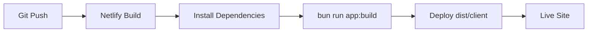

# Deployment

## Netlify

Application deploys to Netlify as a Single Page Application (SPA).

## Build Process

**Config**: [`netlify.toml`](../netlify.toml)
- **Build command**: `bun run app:build`
- **Publish directory**: `dist/client`

**Build configuration**: [`vite.config.ts`](../vite.config.ts)
- SPA mode enabled: `spa: { enabled: true }`
- Assets directory: `public`
- Public directory: `public`

## Routing

**Redirects file**: [`public/_redirects`](../public/_redirects)

All routes redirect to `index.html` for client-side routing:

```
/*    /index.html   200
```

This ensures TanStack Router handles all routes on the client side.

## Environment Variables

Set in Netlify dashboard or via CLI:

- `VITE_CONVEX_URL` - Convex deployment URL
- `CONVEX_DEPLOYMENT` - Convex deployment name/slug (for CLI/dev tooling)
- `SITE_URL` - Public app URL used for OAuth redirects
- `AUTH_GOOGLE_ID` / `AUTH_GOOGLE_SECRET` - Google OAuth credentials
- `AUTH_DISCORD_ID` / `AUTH_DISCORD_SECRET` - Discord OAuth credentials

**Note**: Vite requires `VITE_` prefix for client-side environment variables.

## Deployment Flow


