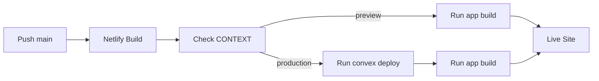

# Deployment

## Netlify

Application deploys to Netlify as a Single Page Application (SPA).
Production deploys run `convex deploy` as part of the Netlify build command.

## Build Process

**Config**: [`netlify.toml`](../netlify.toml)
- **Default build command**: `bun run app:build`
- **Production override** (`[context.production]`): `bun run convex:deploy && bun run app:build`
- **Publish directory**: `dist/client`

**Build configuration**: [`vite.config.ts`](../vite.config.ts)
- SPA mode enabled: `spa: { enabled: true }`
- Assets directory: `public`
- Public directory: `public`

## Routing

**Redirects file**: [`public/_redirects`](../public/_redirects)

All routes redirect to `index.html` for client-side routing:

```
/*    /index.html   200
```

This ensures TanStack Router handles all routes on the client side.

## Environment Variables

Set in Netlify dashboard or via CLI:

- `VITE_CONVEX_URL` - Convex deployment URL
- `CONVEX_DEPLOY_KEY` - Convex deploy key for `convex deploy` in Netlify build
- `CONVEX_DEPLOYMENT` - Convex production deployment slug/name
- `SITE_URL` - Public app URL used for OAuth redirects (Convex env)
- `AUTH_GOOGLE_ID` / `AUTH_GOOGLE_SECRET` - Google OAuth credentials (Convex env)
- `AUTH_DISCORD_ID` / `AUTH_DISCORD_SECRET` - Discord OAuth credentials (Convex env)
- `JWT_PRIVATE_KEY` / `JWKS` - JWT signing and discovery settings (Convex env)

**Note**: Vite requires `VITE_` prefix for client-side environment variables.

## Production Deploy Behavior

Netlify context-specific build commands handle Convex deploy:
- Preview and branch deploy contexts use the default `bun run app:build`
- Production context uses `bun run convex:deploy && bun run app:build`

This means production publish is blocked automatically if Convex deploy fails.

## Deployment Flow



## Go-Live Smoke Test

After each production deploy:
- Confirm site loads and routes resolve.
- Verify OAuth login (Google and Discord).
- Verify profile bootstrap/update works.
- Verify create/update flow for factions and rulesets.
- Verify FAQ create/question/answer flow.
