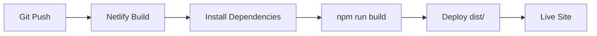

# Deployment

## Netlify

Application deploys to Netlify as a Single Page Application (SPA).

## Build Process

**Build command**: `npm run build`

**Output directory**: `dist` (Vite default)

**Build configuration**: [`vite.config.ts`](../vite.config.ts)
- SPA mode enabled: `spa: { enabled: true }`
- Assets directory: `public`
- Public directory: `public`

## Routing

**Redirects file**: [`public/_redirects`](../public/_redirects)

All routes redirect to `index.html` for client-side routing:

```
/*    /index.html   200
```

This ensures TanStack Router handles all routes on the client side.

## Environment Variables

Set in Netlify dashboard or via CLI:

- `VITE_SUPABASE_URL` - Supabase project URL
- `VITE_SUPABASE_PUBLISHABLE_KEY` - Supabase anon/public key

**Note**: Vite requires `VITE_` prefix for client-side environment variables.

## Netlify CLI

**Command**: `npm run netlify` or `npx netlify`

**Common commands**:
```bash
netlify login          # Authenticate
netlify init          # Initialize project
netlify deploy        # Deploy to draft
netlify deploy --prod # Deploy to production
netlify open          # Open site in browser
```

## Deployment Flow



1. Push to connected Git repository
2. Netlify triggers build
3. Runs `npm run build`
4. Deploys `dist/` directory
5. Site goes live

## Build Settings

Configured in Netlify dashboard or `netlify.toml`:

- **Build command**: `npm run build`
- **Publish directory**: `dist`
- **Node version**: Set in Netlify dashboard (or `.nvmrc`)

## Preview Deploys

Every pull request gets a preview deploy automatically.

Access via Netlify dashboard or PR comments.

## Production Deploys

Deploy to production:

- Push to main branch (auto-deploy)
- Manual deploy via Netlify dashboard
- CLI: `netlify deploy --prod`
