# Deployment

## Current scheduled release contract

The ordered `main` workflow deploys Convex widen-compatible code, runs the required migrations, and
then deploys the already-provisioned Cloudflare Worker in its steady-state scheduled form.

The production Convex project slug is `dunezone` (display name `dune.zone`) and its production
deployment is `exuberant-finch-263`. Renaming the project slug does not change the deployment's
`.convex.cloud` or `.convex.site` URLs, but it does require rotating `CONVEX_DEPLOY_KEY` anywhere
that key is used.

The checked-in publisher release is now the minimal item-only model:

- exactly one `*/5 * * * *` Cron is source controlled;
- every scheduled invocation makes one `take-work` call to Convex;
- an empty `take-work` result exits before Browser launch;
- an assigned result contains at most twenty independently claimed items that run sequentially in
  one Browser session within a four-minute work window; and
- there is no Queue binding, poll endpoint, batch/run entity, quota ledger, or item-count
  deployment knob.

**The production workflow quiesces an active faction-sheet publisher before deploying Convex.** It
only reactivates publishing after the matching Worker has deployed and passed its exact release
smoke. If any intervening step fails, the workflow fails closed and deliberately leaves publishing
paused for operator recovery instead of running mismatched producer and consumer contracts. A
publisher that was already paused or disabled remains non-active and is not automatically enabled.

Cloudflare Workers is the only frontend host. The checked-in Worker configuration attaches the
exact Custom Domain `dune.zone`; Cloudflare manages its DNS record and TLS certificate. After the
custom domain passes the release smoke, the workflow sets the production Convex Auth `SITE_URL` to
`https://dune.zone`.

The workflow mutates only the publisher's pause/activation control boundary around deployment. It
does not mutate publisher items outside the normal scheduled executor, execute the later schema
narrow, or delete the retired remote Queue. The first post-deploy scheduled invocation remains an
operator-observed production canary.

## Build process

**Build configuration**: [`vite.config.ts`](../vite.config.ts)
- SPA mode enabled: `spa: { enabled: true }`
- Assets directory: `public`
- Public directory: `public`

**Unified Worker release build**

```bash
VITE_CONVEX_URL=https://exuberant-finch-263.eu-west-1.convex.cloud bun run publisher:assets
```

This builds `dist/client`, builds the isolated capture bundle, and assembles both into
`workers/publisher/dist`. The assembly copies TanStack's `_shell.html` to the `index.html`
Cloudflare Static Assets requires for SPA fallback and fails if the final bundle violates Workers
asset-count or per-file limits.

For a local end-to-end release rehearsal:

```bash
VITE_CONVEX_URL=https://exuberant-finch-263.eu-west-1.convex.cloud bun run publisher:dry-run
```

CI uses `bun run publisher:release:dry-run` after the already-built assets have been verified.
The pull-request publisher job builds the same production-URL release on Linux and rejects renderer
manifest drift before merge, matching the production runner that enforces a clean source tree.

## Routing and ownership

Cloudflare Static Assets uses `not_found_handling: "single-page-application"`. Requests are
asset-first by default, so ordinary navigation and hashed static files avoid Worker execution. Only
these namespaces are Worker-first:

| Namespace | Owner |
| --- | --- |
| `/published` and `/published/*` | Stable public generated-asset delivery; malformed paths fail closed. |
| `/__asset-publisher` and `/__asset-publisher/*` | Health and operational endpoints. |
| `/publisher-capture`, `/publisher-capture.html`, `/publisher-capture/*` | Protected capture document and bundle. |
| Everything else, including `/factions/*` | Static asset lookup, then SPA fallback. |

The faction-sheet delivery path is
`/published/factions/<Convex faction id>/sheet.pdf`. The `/published` prefix prevents collision with
the user-facing `/factions/<slug>` SPA route.

## Environment variables

Set in **GitHub repository secrets** for CI:

- `VITE_CONVEX_URL`
- `CONVEX_DEPLOY_KEY`
- `CONVEX_DEPLOYMENT`
- `AUTH_GOOGLE_ID` / `AUTH_GOOGLE_SECRET`
- `AUTH_DISCORD_ID` / `AUTH_DISCORD_SECRET`
- `JWT_PRIVATE_KEY` / `JWKS`
- `ASSET_PUBLISHER_ACTIVATION_SECRET` for the human/operator Convex boundary only; never install it
  in the Worker
- `CLOUDFLARE_API_TOKEN`

Set as a **GitHub `production` environment variable**:

- `CLOUDFLARE_ACCOUNT_ID` for the exact account containing the existing Worker and R2 bucket

The Worker secrets `ASSET_PUBLISHER_EXECUTOR_SECRET` and
`ASSET_PUBLISHER_CACHE_TOKEN_SECRET` remain installed directly in Cloudflare. CI validates their
required names against the checked-in contract, but it never reads, rotates, or re-installs their
values.

## GitHub Action

**Workflow**: [`.github/workflows/deploy-main.yml`](../.github/workflows/deploy-main.yml)

On every push to `main`:

1. `bun install --frozen-lockfile`
2. Read the sole Convex publisher config. If active, pause it and remember to reactivate; if already
   paused or disabled, preserve that operator intent and do not reactivate it.
3. `bun run convex:deploy`
4. `bun run migrations:deploy`
5. Run fail-closed Worker preflight over the exact checked-in contract:
   exact `main` SHA and clean tracked source, required protected CI inputs, exact production
   `VITE_CONVEX_URL`, workers.dev origin, the exact `dune.zone` Custom Domain, one exact
   `*/5 * * * *` Cron, no Queue binding, one private R2 binding, exact renderer identity, 30-second
   CPU limit, fixed four-minute work window, 8,000,000-byte PDF cap, and the two required Worker
   secret names.
6. Check generated Worker bindings and typecheck the Worker release.
7. Build the SPA and capture bundle once with the protected `VITE_CONVEX_URL`, re-check assembled
   asset limits, and reject generated-source drift.
8. Dry-run the exact checked-in Worker release and then deploy it in strict mode with the full
   `GITHUB_SHA` as the Worker version tag.
9. Smoke the exact checked-in workers.dev and `dune.zone` health URLs and require:
   `ok: true`, `maxItems: 20`, schedule `*/5 * * * *`, exact renderer support/manifest agreement,
   `Cache-Control: no-store`, and the deployed Git SHA tag.
10. If the workflow paused an active publisher in step 2, reactivate it with the exact checked-in
    renderer and require the returned status and renderer to match.
11. Set the production Convex Auth `SITE_URL` to `https://dune.zone`.

Steps 2-10 are intentionally asymmetric: any failure after the pause leaves publishing paused. Do
not manually reactivate until the failed release has been diagnosed and the deployed producer and
consumer are confirmed compatible.

Wrangler receives only `CLOUDFLARE_API_TOKEN` and `CLOUDFLARE_ACCOUNT_ID`. It does not receive
Cron or route overrides, a secrets file, or activation flags. The checked-in Wrangler config is the
entire deployment contract.

The protected `CLOUDFLARE_API_TOKEN` must stay scoped to the one Cloudflare account and the minimum
permission set needed to update the existing Worker, Custom Domain, and bindings. Do not grant or
exercise secret-management, billing, or unrelated-resource access.

## Pull-request Cloudflare drift guard

`.github/workflows/cloudflare-live-drift.yml` compares production Cloudflare state with the trusted
`main` contract on every pull request. It uses `pull_request_target`, checks out only the base SHA,
and never checks out or executes pull-request-authored code. Keep that boundary intact: changing the
workflow to execute the head revision would expose a repository secret to untrusted code.

Configure a repository secret named `CLOUDFLARE_READ_API_TOKEN` with only these account-level read
permissions:

- Workers Scripts Read;
- Queues Read; and
- Workers R2 Storage Read.

Do not reuse `CLOUDFLARE_API_TOKEN`; that deployment credential has write authority. The drift
script issues only authenticated `GET` requests and checks the exact Worker Custom Domain, bindings,
secret names, Cron schedule, repository-owned Queue inventory, and private R2 bucket/domain state
declared in `infra/cloudflare-live-contract.json` and `workers/publisher/wrangler.jsonc`.

After the workflow has run once on `main`, make `Cloudflare live drift / audit` a required status
check for the `main` branch. The repository currently has no branch protection, so adding the
workflow alone does not block merging. The workflow is loaded from the default branch for security,
which also means the pull request that first introduces it is a bootstrap change: the check begins
on subsequent pull requests after this workflow is merged.

## Migrations on every `main` deploy

On push to `main`, [`.github/workflows/deploy-main.yml`](../.github/workflows/deploy-main.yml) runs
`bun run migrations:deploy` immediately after `bun run convex:deploy`. That starts and waits for
all widen migrations listed in [`convex/migration-guards.json`](../convex/migration-guards.json).
No separate manual migration command is required when the workflow succeeds.

## Current deployment flow

```mermaid
flowchart LR
    Git[Push main] --> GHA[GitHub Actions]
    GHA --> Quiesce[Quiesce active publisher]
    Quiesce --> ConvexDeploy[Deploy widen-compatible Convex state]
    ConvexDeploy --> Migrations[Run and verify required migrations]
    Migrations --> Preflight[Fail-closed Worker preflight]
    Preflight --> Build[Build one unified release]
    Build --> DryRun[Wrangler dry-run]
    DryRun --> WorkerDeploy[Strict Worker deploy tagged with Git SHA]
    WorkerDeploy --> Smoke[workers.dev + dune.zone release smoke]
    Smoke --> Activate[Restore active state with exact renderer]
    Activate --> SiteUrl[Set Convex SITE_URL to dune.zone]
```



Wrangler manages the exact `dune.zone` Custom Domain from source control. The workflow changes only
the publisher control status and public Convex Auth `SITE_URL`; it does not install or read
publisher secrets, change OAuth provider credentials, mutate publisher items directly, or send
Queue work.

## First scheduled-release observation

The repository has no supported read-only Wrangler command that reports the deployed Cron trigger
shape. CI validates the source contract; live trigger readback remains an operator runbook step.

After the first merged scheduled release:

1. Reconfirm through authorized read-only Convex state that the faction-sheet publisher config
   returned to its pre-deploy operator intent. If active, require the exact deployed renderer; in
   every state, require no unexpected live claims.
2. Require the deploy smoke to report `maxItems: 20`, schedule `*/5 * * * *`, exact renderer
   identity, and the merged full Git SHA on workers.dev and `dune.zone`.
3. Read the trigger in the Cloudflare dashboard and require exactly one `*/5 * * * *` schedule.
4. Observe at least one `asset_publisher_cron` log. If no faction changed during deployment, expect
   `result: "empty"` and `reason: "no_eligible_work"`.
   If the workflow failed after pausing, expect `reason: "disabled"` until recovery.
   If a previous claim is still live, expect `reason: "busy"` with a future `leaseExpiresAt`.
   If publishing is active but there is nothing eligible, expect `reason: "no_eligible_work"`.
5. Reconfirm that the empty observation produced no Browser session.
6. If work was eligible, require every assigned item to complete or have an attributable failure;
   investigate any infrastructure failure before schema narrow or remote Queue cleanup.

## Convex breaking migrations

For any migration that can invalidate existing Convex documents, follow the required runbook:

- [`docs/convex-migrations.md`](./convex-migrations.md)

Required sequence:

1. Widen schema and deploy compatibility reads/writes.
2. Auto-run bounded production migrations in the deploy workflow.
3. Verify zero unmigrated rows remain.
4. Narrow schema and remove temporary fallback/migration code later.

Do not deploy the narrowing schema before verification is complete.

## Go-live smoke test

After each production deploy:

- Confirm the site loads and routes resolve.
- Verify OAuth login (Google and Discord).
- Verify profile bootstrap/update works.
- Verify create/update flow for factions and rulesets.
- Verify FAQ create/question/answer flow.
