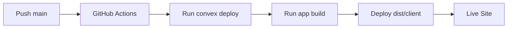

# Deployment

## Netlify

Application deploys to Netlify as a Single Page Application (SPA).
Production deploys are orchestrated by GitHub Actions: deploy Convex first, then publish `dist/client` to Netlify.

## Build Process

**Config**: [`netlify.toml`](../netlify.toml)
- **Default build command**: `bun run app:build`
- **Production override** (`[context.production]`): `bun run convex:deploy && bun run app:build` (legacy fallback when building directly in Netlify)
- **Publish directory**: `dist/client`

**Build configuration**: [`vite.config.ts`](../vite.config.ts)
- SPA mode enabled: `spa: { enabled: true }`
- Assets directory: `public`
- Public directory: `public`

## Routing

**Redirects file**: [`public/_redirects`](../public/_redirects)

All routes redirect to `index.html` for client-side routing:

```
/*    /index.html   200
```

This ensures TanStack Router handles all routes on the client side.

## Environment Variables

Set in **GitHub repository secrets** for CI:

- `NETLIFY_AUTH_TOKEN`
- `NETLIFY_SITE_ID`
- `VITE_CONVEX_URL` - Convex deployment URL
- `CONVEX_DEPLOY_KEY` - Convex deploy key for `convex deploy`
- `CONVEX_DEPLOYMENT` - Convex production deployment slug/name
- `SITE_URL` - Public app URL used for OAuth redirects (Convex env)
- `AUTH_GOOGLE_ID` / `AUTH_GOOGLE_SECRET` - Google OAuth credentials (Convex env)
- `AUTH_DISCORD_ID` / `AUTH_DISCORD_SECRET` - Discord OAuth credentials (Convex env)
- `JWT_PRIVATE_KEY` / `JWKS` - JWT signing and discovery settings (Convex env)

Keep the same values in Netlify only if you still plan to run manual Netlify builds.

**Note**: Vite requires `VITE_` prefix for client-side environment variables.

## GitHub Action

**Workflow**: [`.github/workflows/deploy-main.yml`](../.github/workflows/deploy-main.yml)

On every push to `main`:
1. `bun install --frozen-lockfile`
2. `bun run convex:deploy`
3. `bun run app:build`
4. Deploy `dist/client` to Netlify using API token + site id

The Netlify publish step runs only if Convex deploy and build succeed.

## Netlify One-Time Setup

In Netlify UI:

1. **Site configuration -> Build & deploy -> Continuous Deployment**
   - Disable automatic Git-triggered deploys (or disconnect the repo) so GitHub Actions is your single production deploy path.
2. **Site configuration -> Build & deploy -> Build settings**
   - Keep `bun run app:build` and `dist/client` as fallback values for manual Netlify builds.
3. Keep redirects from [`public/_redirects`](../public/_redirects) so SPA routes continue working.

## Deployment Flow



## Go-Live Smoke Test

After each production deploy:
- Confirm site loads and routes resolve.
- Verify OAuth login (Google and Discord).
- Verify profile bootstrap/update works.
- Verify create/update flow for factions and rulesets.
- Verify FAQ create/question/answer flow.
