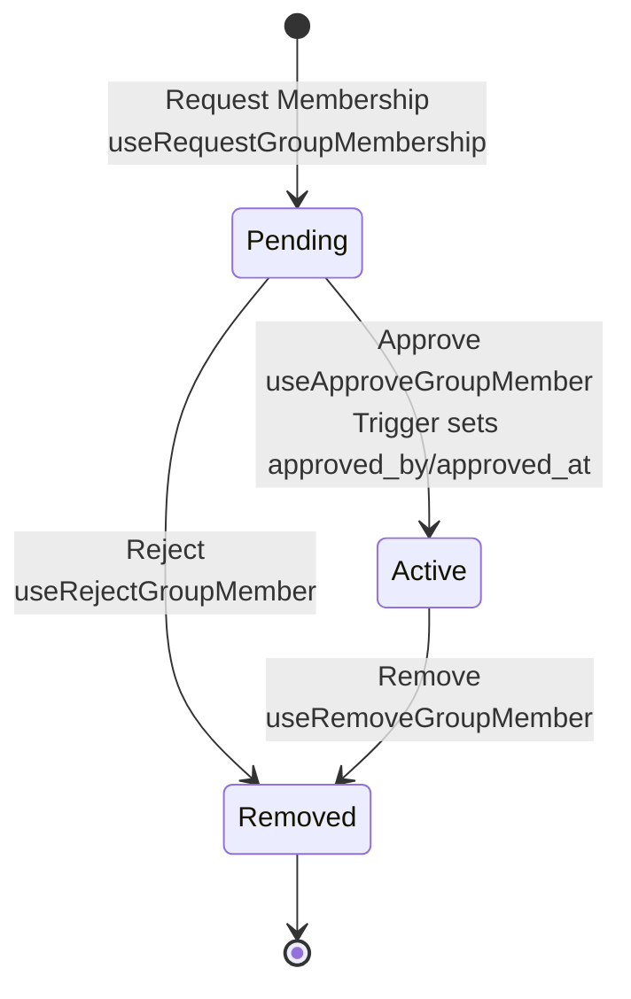

# Membership

## Approval Flow

Status transitions: `pending` → `active` (approved) or `removed` (rejected/removed).

## Status Enum

**Type**: `group_member_status` enum

- `pending` - Membership requested, awaiting approval
- `active` - Approved, active member
- `removed` - Rejected or removed

## Approval Metadata

`approved_by` and `approved_at` are set in Convex membership mutations when status becomes `active`.

## Hooks

**Mutations**: `useRequestGroupMembership`, `useApproveGroupMember`, `useRejectGroupMember`, `useRemoveGroupMember`

**Queries**: `useGroupMembers`, `useGroupMembersByStatus`, `useGroupMember`, `useUserGroupMemberships` (mount only when `userId` is known), `useUserGroupMembershipGroups` (helper over membership rows)

**Example**: [`src/app/members/db.ts`](../src/app/members/db.ts)

## Authorization

Convex handlers in `convex/members.ts` enforce:

- **`approve` / `reject`**: Caller must be an **active** member of the group (`isActiveGroupMember`). Target row must be **`pending`**.
- **`remove`**: Only the **group creator** (`groups.created_by`) may remove someone else. Cannot remove the creator. Target must be **`active`** (pending requests are handled with `reject`).
- **`request` / `add`**: See `convex/members.ts` (authenticated; `add` requires active membership).

Shared helpers live in `convex/lib/policy.ts` (`requireAuthUserId`, `isActiveGroupMember`).
