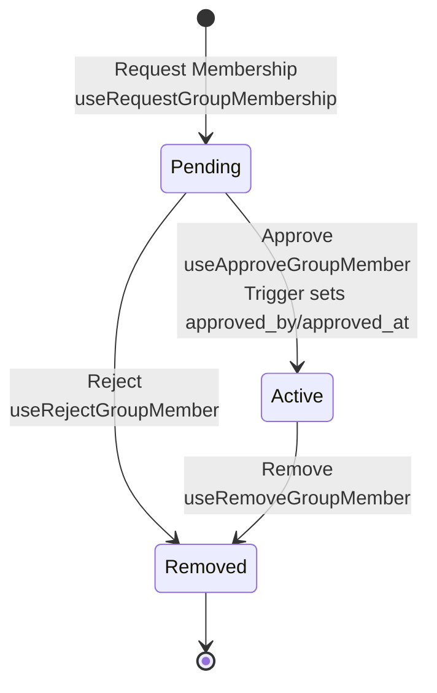

# Membership

## Approval Flow



Status transitions: `pending` → `active` (approved) or `removed` (rejected/removed).

## Status Enum

**Type**: `group_member_status` enum

- `pending` - Membership requested, awaiting approval
- `active` - Approved, active member
- `removed` - Rejected or removed

**Definition**: [`supabase/migrations/20260311232351_convert_status_to_enum.sql`](../supabase/migrations/20260311232351_convert_status_to_enum.sql)

## Database Trigger

**Function**: `set_group_members_approval()`

Automatically sets `approved_by` and `approved_at` when status becomes `active`:

```sql
if new.status = 'active' then
  new.approved_by := auth.uid();
  new.approved_at := now();
end if;
```

**File**: [`supabase/migrations/20260311222016_fix_group_members_trigger.sql`](../supabase/migrations/20260311222016_fix_group_members_trigger.sql)

## Hooks

### Request Membership

```typescript
useRequestGroupMembership()
```

Creates membership with `status: 'pending'`.

**Example**: [`src/app/db/domains/members.ts`](../src/app/db/domains/members.ts#L113-L146)

### Approve Member

```typescript
useApproveGroupMember({ groupId, userId })
```

Updates status to `active`. Trigger sets `approved_by` and `approved_at`.

**Example**: [`src/app/db/domains/members.ts`](../src/app/db/domains/members.ts#L148-L177)

### Reject Member

```typescript
useRejectGroupMember({ groupId, userId })
```

Updates status to `removed`, clears `approved_by` and `approved_at`.

**Example**: [`src/app/db/domains/members.ts`](../src/app/db/domains/members.ts#L179-L210)

### Remove Member

```typescript
useRemoveGroupMember({ groupId, userId })
```

Updates status to `removed`, clears approval fields.

**Example**: [`src/app/db/domains/members.ts`](../src/app/db/domains/members.ts#L212-L239)

## Query Hooks

```typescript
useGroupMembers(groupId)                    // All members
useGroupMembersByStatus(groupId, status)    // Filtered by status
useGroupMember(groupId, userId)             // Single member
```

**Example**: [`src/app/db/domains/members.ts`](../src/app/db/domains/members.ts#L30-L109)

## Row Level Security

Policies control access:

- Users can request membership (INSERT with `status: 'pending'`)
- Active members can view all memberships
- Active members can update status (approve/reject)

**Policies**: [`supabase/migrations/20260311232351_convert_status_to_enum.sql`](../supabase/migrations/20260311232351_convert_status_to_enum.sql#L30-L54)
