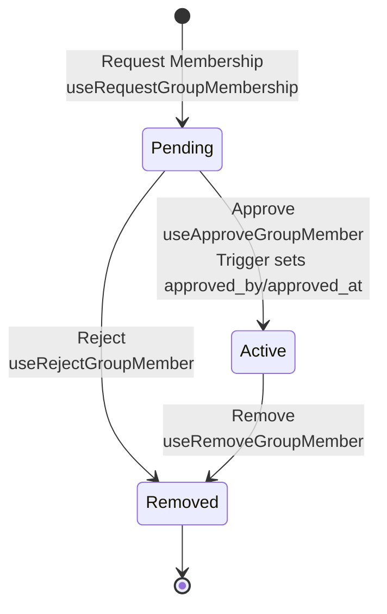

# Membership

## Approval Flow

Status transitions: `pending` → `active` (approved) or `removed` (rejected/removed).

## Status Enum

**Type**: `group_member_status` enum

- `pending` - Membership requested, awaiting approval
- `active` - Approved, active member
- `removed` - Rejected or removed

## Approval Metadata

`approved_by` and `approved_at` are set in Convex membership mutations when status becomes `active`.

## Hooks

**Mutations**: `useRequestGroupMembership`, `useApproveGroupMember`, `useRejectGroupMember`, `useRemoveGroupMember`

**Queries**: `useGroupMembers`, `useGroupMembersByStatus`, `useGroupMember`

**Example**: [`src/app/members/db.ts`](../src/app/members/db.ts)

## Authorization

Authorization is enforced by Convex policy helpers (`requireAuthUserId`, `isActiveGroupMember`) in `convex/lib/policy.ts`.
