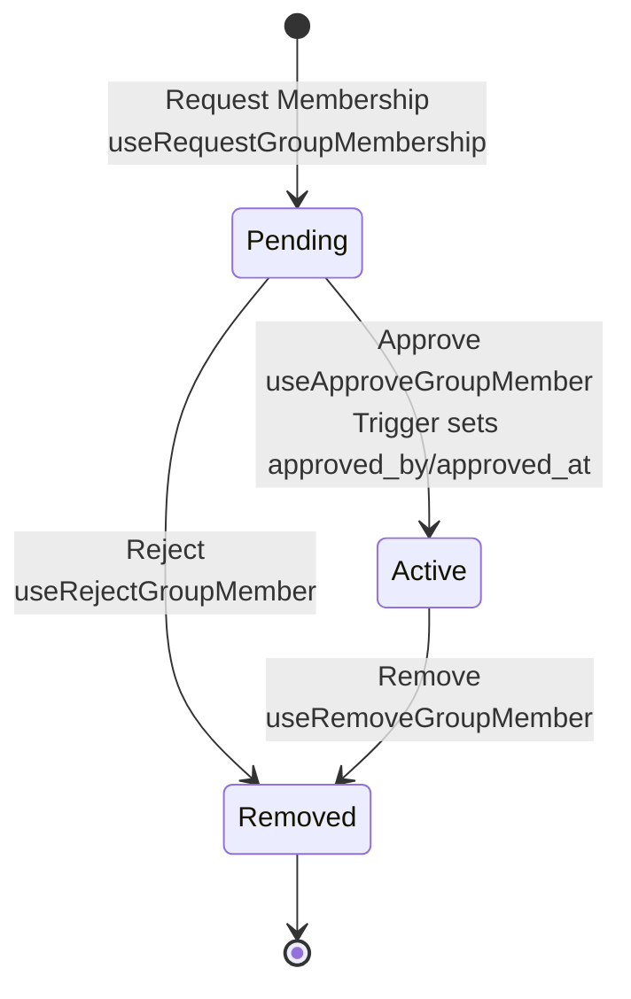

# Membership

## Approval Flow

Status transitions: `pending` → `active` (approved) or `removed` (rejected/removed).

## Status Enum

**Type**: `group_member_status` enum

- `pending` - Membership requested, awaiting approval
- `active` - Approved, active member
- `removed` - Rejected or removed

## Database Trigger

**Function**: `set_group_members_approval()` - sets `approved_by` and `approved_at` when status becomes `active`. Defined in `supabase/migrations/`.

## Hooks

**Mutations**: `useRequestGroupMembership`, `useApproveGroupMember`, `useRejectGroupMember`, `useRemoveGroupMember`

**Queries**: `useGroupMembers`, `useGroupMembersByStatus`, `useGroupMember`

**Example**: [`src/app/db/domains/members.ts`](../src/app/db/domains/members.ts)

## Row Level Security

RLS policies enforce who can request, view, and approve membership.
