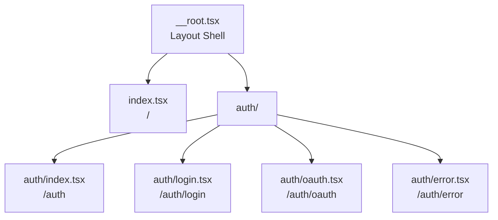

# Routing

## Route Structure



Routes live in `src/app/routes/`. File structure maps directly to URLs.

## File-Based Routing

**Location**: `src/app/routes/`

**Pattern**:
- `index.tsx` → `/`
- `about.tsx` → `/about`
- `users/$userId.tsx` → `/users/:userId`
- `auth/login.tsx` → `/auth/login`

Route tree auto-generates: [`src/app/routeTree.gen.ts`](../src/app/routeTree.gen.ts)

## Router Configuration

**File**: [`src/app/router.tsx`](../src/app/router.tsx)

```typescript
const router = createTanStackRouter({
  routeTree,
  scrollRestoration: true,
  defaultPreload: 'intent',        // Preload on hover/focus
  defaultPreloadStaleTime: 0,      // Always refetch stale data
});
```

## Route Pattern

```typescript
import { createFileRoute } from '@tanstack/react-router';

export const Route = createFileRoute('/path')({
  component: Component,
  loader: async () => {
    // Fetch data before render
    return { data };
  },
});

function Component() {
  const { data } = Route.useLoaderData();
  // Use data
}
```

**Example**: [`src/app/routes/index.tsx`](../src/app/routes/index.tsx)

## Root Route

**File**: [`src/app/routes/__root.tsx`](../src/app/routes/__root.tsx)

- Provides HTML shell (`<html>`, `<head>`, `<body>`)
- Includes global styles
- Sets up devtools (development only)
- Handles 404s (`NotFound` component)

## Type Safety

Router types registered for autocomplete:

```typescript
declare module '@tanstack/react-router' {
  interface Register {
    router: ReturnType<typeof getRouter>;
  }
}
```

**File**: [`src/app/router.tsx`](../src/app/router.tsx#L17-L21)

## Loader Pattern

Loaders fetch data before component renders:

```typescript
loader: async () => {
  const { data } = await db.from('table').select();
  return { data };
}
```

Access in component: `Route.useLoaderData()`

**Example**: [`src/app/routes/index.tsx`](../src/app/routes/index.tsx#L8-L11)
