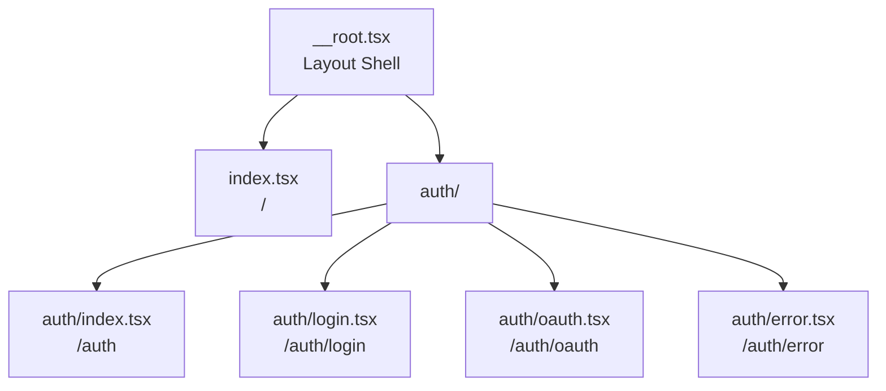

# Routing

## Route Structure



Routes live in `src/app/routes/`. File structure maps directly to URLs.

## File-Based Routing

**Location**: `src/app/routes/` - e.g. `index.tsx` → `/`, `auth/login.tsx` → `/auth/login`. Route tree auto-generates: [`src/app/routeTree.gen.ts`](../src/app/routeTree.gen.ts)

## Route Pattern

```typescript
import { createFileRoute } from '@tanstack/react-router';

export const Route = createFileRoute('/path')({
  component: Component,
  loader: async () => {
    // Fetch data before render
    return { data };
  },
});

function Component() {
  const { data } = Route.useLoaderData();
  // Use data
}
```

**Example**: [`src/app/routes/index.tsx`](../src/app/routes/index.tsx)

## Root Route

**File**: [`src/app/routes/__root.tsx`](../src/app/routes/__root.tsx)

- Provides HTML shell (`<html>`, `<head>`, `<body>`)
- Includes global styles
- Sets up devtools (development only)
- Handles 404s (`NotFound` component)

Access loader data in component: `Route.useLoaderData()`
