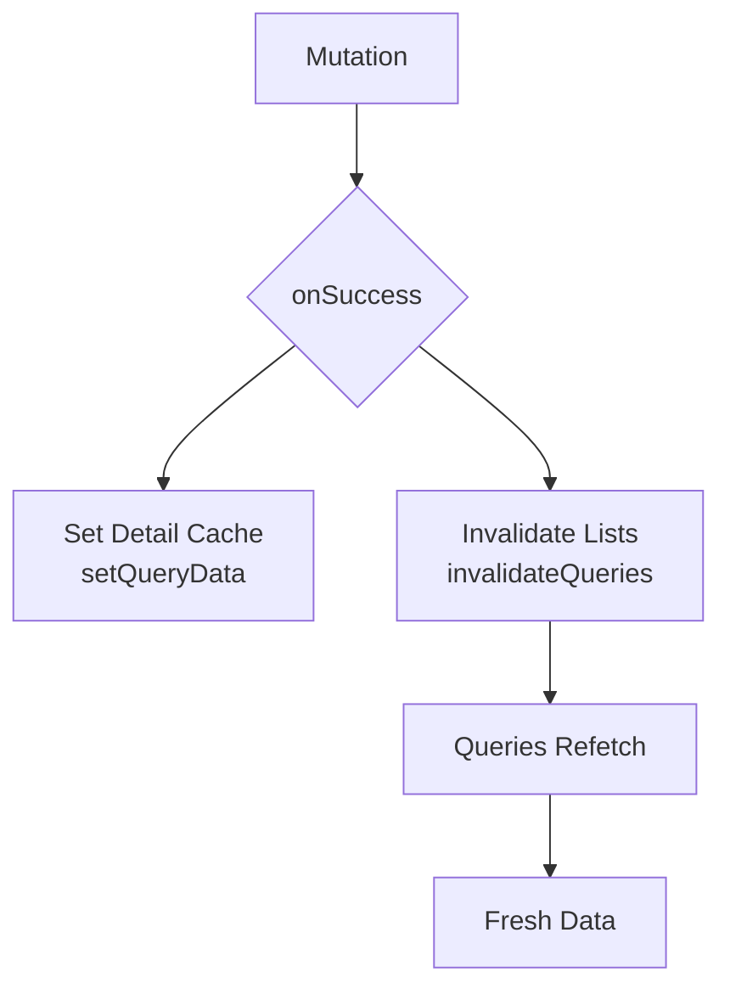

# State Management

## Cache Invalidation Flow



Mutations update detail cache immediately, invalidate list queries to refetch.

## Query Key Structure

Hierarchical keys for predictable invalidation:

```typescript
export const domainKeys = {
  all: ['domain'] as const,
  lists: () => [...domainKeys.all, 'list'] as const,
  list: (filters: object) => [...domainKeys.lists(), filters] as const,
  detail: (id: string) => [...domainKeys.all, 'detail', id] as const,
};
```

**Benefits**:
- `invalidateQueries({ queryKey: domainKeys.lists() })` → invalidates all lists
- `invalidateQueries({ queryKey: domainKeys.all })` → invalidates everything

**Example**: [`src/app/db/domains/factions.ts`](../src/app/db/domains/factions.ts#L25-L30)

## Query Hooks

Custom hooks encapsulate query logic:

```typescript
export function useDomainDetail(id: string) {
  const qc = useQueryClient();
  return useQuery({
    queryKey: domainKeys.detail(id),
    queryFn: async () => { ... },
    initialData: () => 
      qc.getQueryData(domainKeys.list({}))?.find(d => d.id === id),
  });
}
```

**Example**: [`src/app/db/domains/factions.ts`](../src/app/db/domains/factions.ts#L34-L58)

## Initial Data Optimization

Use `initialData` to populate from cache:

```typescript
initialData: () => {
  const qc = useQueryClient();
  return qc.getQueryData<DomainEntry[]>(domainKeys.list({}))
    ?.find((d) => d.id === id);
}
```

Reduces network requests by using cached data first.

**Example**: [`src/app/db/domains/factions.ts`](../src/app/db/domains/factions.ts#L55-L57)

## Cache Updates on Mutations

### Create

```typescript
onSuccess: (data) => {
  qc.setQueryData(domainKeys.detail(data.id), data);
  qc.invalidateQueries({ queryKey: domainKeys.lists() });
}
```

**Example**: [`src/app/db/domains/factions.ts`](../src/app/db/domains/factions.ts#L184-L187)

### Update

```typescript
onSuccess: (data) => {
  qc.setQueryData(domainKeys.detail(data.id), data);
  qc.invalidateQueries({ queryKey: domainKeys.lists() });
}
```

**Example**: [`src/app/db/domains/factions.ts`](../src/app/db/domains/factions.ts#L216-L219)

### Delete

```typescript
onSuccess: (id) => {
  qc.removeQueries({ queryKey: domainKeys.detail(id) });
  qc.invalidateQueries({ queryKey: domainKeys.lists() });
}
```

**Example**: [`src/app/db/domains/factions.ts`](../src/app/db/domains/factions.ts#L234-L237)

## Error Handling

Throw errors from query functions:

```typescript
if (error) {
  throw error;
}
```

TanStack Query handles errors automatically, provides error state to components.

**Example**: [`src/app/db/domains/factions.ts`](../src/app/db/domains/factions.ts#L42-L44)
