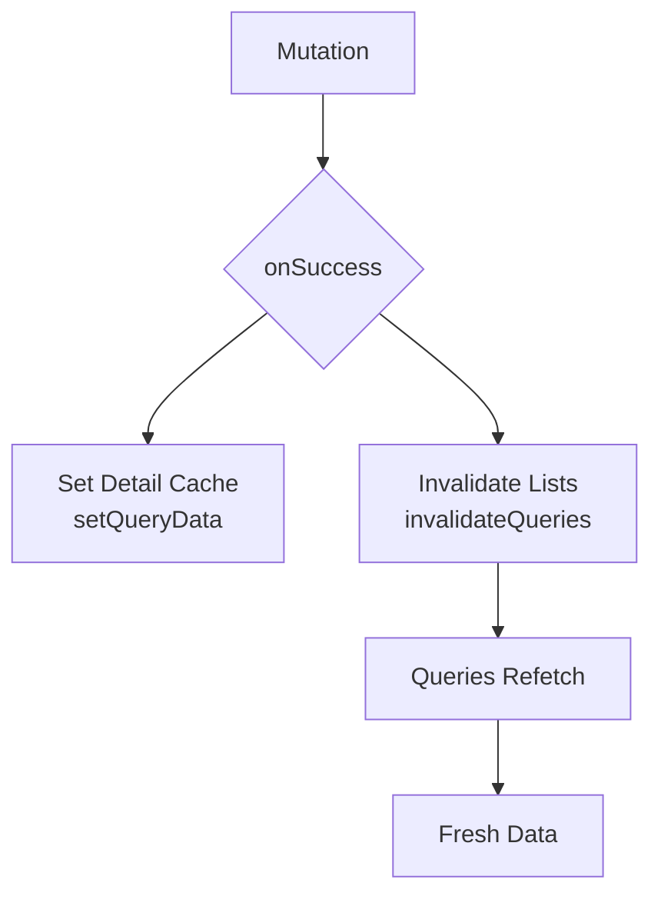

# State Management

## Cache Invalidation Flow



Mutations update detail cache immediately, invalidate list queries to refetch.

## Query Key Structure

Hierarchical keys for predictable invalidation:

```typescript
export const domainKeys = {
  all: ['domain'] as const,
  lists: () => [...domainKeys.all, 'list'] as const,
  list: (filters: object) => [...domainKeys.lists(), filters] as const,
  detail: (id: string) => [...domainKeys.all, 'detail', id] as const,
};
```

**Benefits**:
- `invalidateQueries({ queryKey: domainKeys.lists() })` → invalidates all lists
- `invalidateQueries({ queryKey: domainKeys.all })` → invalidates everything

**Example**: [`src/app/db/domains/factions.ts`](../src/app/db/domains/factions.ts)

## Query Hooks

Custom hooks encapsulate query logic. Use `initialData` to populate from cache when available, reducing network requests.

## Cache Updates on Mutations

**Create/Update**: `setQueryData(detail)`, then `invalidateQueries(lists)` - same pattern for both.

**Delete**: `removeQueries(detail)`, then `invalidateQueries(lists)`

**Example**: [`src/app/db/domains/factions.ts`](../src/app/db/domains/factions.ts)
