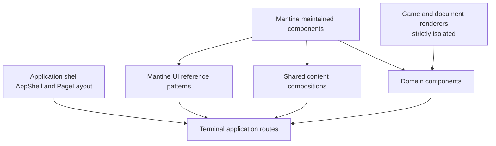

# UI component hierarchy and ownership

Mantine owns standard application-content UI. The application owns its persistent shell, route composition, proven shared content compositions, and Dune Zone domain behavior. Precision renderers remain a separate system.

## Ownership layers

| Layer | Owner and location | Composition rule |
|---|---|---|
| Mantine components | `@mantine/core` and deliberately adopted companion packages | Use APIs directly for standard controls, surfaces, layout, feedback, overlays, and typography. |
| Mantine UI patterns | Free Mantine UI reference catalogue | Adapt page-composition patterns route-locally first; an example is not automatically a shared component. |
| Shared content compositions | Locally owned components with proven repeated product semantics | Compose Mantine; expose a small semantic API; keep concern boundaries focused. |
| Domain components | Domain folders such as `factions`, `faq`, and `profile` | Own Dune Zone behavior and identity-rich visuals; Mantine may frame the domain-specific core. |
| Application shell | `src/app/components/shell/**` | `AppShell` owns persistent chrome; terminal routes compose `PageLayout` slots directly. |
| Game and document renderers | `src/game/**`, sheets, print, capture, and publishing entry points | Remain independent of Mantine and preserve exact rendering output. |

`FactionListItem`, leader/troop/planet showcases, and similar identity-rich displays belong in the domain layer. Generic buttons, cards, fields, toolbars, accordions, description lists, and layout stacks belong to Mantine rather than a new local primitive layer.

## Dependency direction

- Routes may compose the shell, Mantine, shared content compositions, and domain components.
- Shared content compositions may compose Mantine and narrowly scoped domain-neutral utilities.
- Domain components may compose Mantine around domain behavior and embed game renderers without styling their internals.
- The application shell may compose Mantine where a later shell-specific change explicitly calls for it, but adopting Mantine does not authorize a shell redesign.
- Game, sheet, print, capture, and publishing renderer code must not import Mantine, consume its theme, mount its provider, or depend on Mantine styles.
- No generic or shared layer may pull domain behavior upward merely to make it reusable.

## Direct composition before wrappers

Prefer Mantine components directly at call sites. Do not create application wrappers whose only purpose is to rename or lightly forward `Button`, `ActionIcon`, `Card`, `Paper`, `Stack`, `Group`, `Grid`, `Text`, `Title`, `Tooltip`, `Select`, or similar APIs.

Use Mantine UI as a composition catalogue, then adapt a selected pattern in the terminal route. Extract a shared content composition only when pilots or repeated product use demonstrate stable semantics or a genuinely repeated composition—not merely repeated JSX.

TanStack Router's typed `Link` remains the navigation owner. Use Mantine's `renderRoot` integration at the call site so Mantine root props reach `Link`. Extract a routing adapter only if repeated usage proves it preserves typed `to`, `params`, and `search` without recreating the old broad button API.

## Route and data ownership

Every terminal visual `_app` route renders `PageLayout` and supplies its `header`, optional `toolbar`, and content together. Nested parent routes remain outlet-only. The application shell owns persistent chrome and document effects, not page-specific composition.

Each route subscribes to at most one Convex query for page data, plus `useCurrentProfile` when needed. Pass query-derived data into child components instead of creating nested subscriptions for the same screen.

Document-only render targets and non-visual auth handoffs remain intentional route-layout exceptions.

## Domain visuals and concern boundaries

Domain ownership is not a license for a second generic component system. A domain component should own Dune Zone behavior, terminology, data interpretation, or a distinctive visual identity. Standard outer layout, typography, actions, fields, and feedback should still come from Mantine.

Components are concern boundaries, not extracted sub-views. Keep a page fragment inline unless extraction creates a focused behavior or domain concept with a small semantic API. Locally owned shared content and domain components should receive representative Storybook coverage for their meaningful visual and interaction states. Installed Mantine components and route-local Mantine compositions do not require duplicate stories.

## Styling ownership

- Prefer Mantine props and semantic APIs for ordinary application UI.
- Use Mantine theme variables and Styles API for intentional system-level customization.
- CSS Modules remain appropriate for domain visuals, existing shell ownership, and page-specific composition Mantine cannot clearly express.
- Only a component's TSX owner imports its CSS module. Do not import another component's stylesheet as an API.
- Do not use CSS Modules `composes`; combine owned classes and components in TSX.
- Do not globally target Mantine internal selectors for routine styling.
- Keep parent compositions responsible for routine spacing. Flex plus `gap` and CSS Grid remain valid when custom layout is warranted.

## Migration-only legacy presentation

These existing paths are compatibility surfaces for migration, not canonical discovery or extension points:

- `src/app/components/generic/ui/**`;
- `src/app/components/generic/layout/**`;
- `src/app/components/generic/surfaces/**`;
- current presentation primitives under `src/app/components/form/**`.

Do not add new consumers or expand their presentation APIs. Migrate consumers when their owning route or component is in scope, and remove legacy primitives only after consumers reach zero. Domain behavior, TanStack Form state, and validation contracts are not deprecated merely because they currently compose legacy presentation.

The Mantine foundation is installed for normal application content with a fixed light scheme. The application imports Mantine's layered stylesheet before legacy application styles and mounts one provider inside the preserved application shell. Bare faction-sheet output bypasses the provider. See the [content migration rollout](./ui-content-migration.md) for the settled pilot conventions, remaining route inventory, and retirement waves.

## Renderer isolation checklist

- No Mantine imports under `src/game/**`.
- No Mantine provider, theme, styles, or component imports in sheet, print, capture, or publishing renderer entry points.
- Embedded game visuals may be positioned by application-page layout, but their internals and output remain unchanged.
- A page migration must not move global styles across the renderer boundary.
