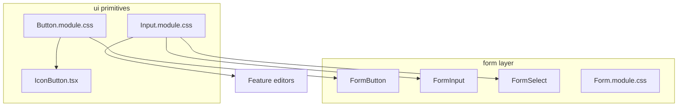

# UI component hierarchy and composition

## Principles

### React is the composition engine

Shared visuals are expressed by composing **components** and **`className` lists** (typically with `clsx`) in TypeScript/TSX. We do **not** use CSS Modules `composes` for reuse: it obscures dependency direction at build time and encourages the wrong mental model (e.g. generic controls “inheriting” from form-specific sheets).

### Strict dependency direction

More primitive / generic layers **must not** depend on more specific ones:

| Layer | Path | May import from |
|-------|------|-----------------|
| Primitives | `src/app/components/ui/**` | Other `ui` modules, shared tokens |
| Form | `src/app/components/form/**` | `ui`, shared tokens |
| Features / routes | e.g. `factions`, `routes` | `form`, `ui`, shared tokens |

**Forbidden:** `ui` importing from `form` or from feature folders.

### Role of CSS Modules

CSS Modules provide **scoped class names** and hook into design tokens (`var(--…)`). Prefer **one concern per class**; when an element needs “base + modifier” behavior, apply **multiple classes in TSX** (`clsx(base, modifier, local)`) instead of `composes`.

### Shared control styles

Low-level control chrome (buttons, text fields) lives under **`src/app/components/ui/`** (e.g. `Button.module.css`, `Input.module.css`). Form-specific layout and labels stay in `Form.module.css` and form components; they **import** primitive styles and compose them in React.

## Diagram

## Guardrails

- After changes, confirm there are **no** `composes:` declarations in project `*.css` files (`rg 'composes:' --glob '*.css'`).
- Optional: add Stylelint or CI checks to forbid `composes` in new CSS.
