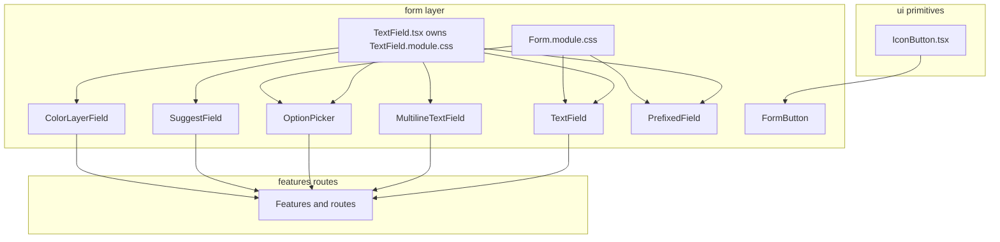

# UI component hierarchy and composition

## Principles

### React is the composition engine

Shared visuals are expressed by composing **components** and **`className` lists** (typically with `clsx`) in TypeScript/TSX. We do **not** use CSS Modules `composes` for reuse: it obscures dependency direction at build time and encourages the wrong mental model (e.g. generic controls “inheriting” from form-specific sheets).

### Strict dependency direction

More primitive / generic layers **must not** depend on more specific ones:

| Layer | Path | May import from |
|-------|------|-----------------|
| Primitives | `src/app/components/generic/ui/**` | Other `generic/ui` modules, shared tokens |
| Form | `src/app/components/form/**` | `generic/ui`, shared tokens |
| Layout / surfaces | `src/app/components/generic/layout/**`, `src/app/components/generic/surfaces/**` | `generic/ui`, `form`, shared tokens |
| Features / routes | domain folders (`factions`, `faq`, `profile`, `auth`) and `routes` | `generic/**`, `form/**`, shared tokens, same-domain modules |

**Forbidden:** anything in `generic/**` importing from domain folders.

### Role of CSS Modules

CSS Modules provide **scoped class names** and hook into design tokens (`var(--…)`). Prefer **one concern per class**; when an element needs “base + modifier” behavior, apply **multiple classes in TSX** (`clsx(base, modifier, local)`) instead of `composes`.

### Owning a CSS module (no cross-imports)

**Anti-pattern:** a component importing **`AnotherThing.module.css`** when that file “belongs” to another component or folder (e.g. a feature importing `ui/Input.module.css` directly). That hides the real API and scatters styling ownership.

**Do this instead:** import the **TSX primitive** that owns the stylesheet (e.g. `TextField`, `MultilineTextField`, `textFieldClassNames` from [`TextField.tsx`](../../src/app/components/form/TextField.tsx)), or import a composed control from `src/app/components/form/` (see below). Only the file that ships with the module should import `TextField.module.css`.

### Shared control styles

Low-level icon/button chrome lives under **`src/app/components/generic/ui/`** (`IconButton`). Field-control chrome lives under **`src/app/components/form/`** (`TextField.module.css`).

Form-specific layout and labels stay in `form/Form.module.css` and form components; they compose primitives in React—**without** importing another module's CSS directly.

`TextField` is always styled as the canonical single-line control. When nested in [`PrefixedField`](../../src/app/components/form/PrefixedField.tsx), the container owns chrome reset via local CSS so the outer shell provides the single border.

### Naming (form layer)

| Name | Role |
|------|------|
| `FormField` | Label, hint, error chrome around a child control (not a text box by itself). |
| `TextField`, `MultilineTextField`, `OptionPicker`, pickers | Composed field controls for product UI. |
| `PrefixedField` | Affix container (prefix/suffix) sharing one bordered “input” shell; nested text controls inherit chrome reset from the container. |
| `FormPrefixedInput` | Deprecated alias of `PrefixedField`; do not use in new code. |

### Standard form controls (composed API)

Prefer these exports from `src/app/components/form` for product UI:

| Component | Purpose |
|-----------|---------|
| `TextField` | Single-line text |
| `MultilineTextField` | Multi-line text |
| `OptionPicker` | Single choice from a list (Radix select) |
| `SuggestField` | Generic typeahead/combobox with optional grouped matching, keyboard navigation, and optional preview popout. |
| `HexColorPicker` | Compact hex color control: swatch, popover (`react-colorful`), and hex text in a `PrefixedField` (app-wide; lives in `form/`) |
| `ColorLayerField` | Generic color layer editor for solid/gradient values (linear/radial) with editable stops. |
| `PrefixedField` | Prefix/suffix + shared border around the main control |

All controls above are wrapper-agnostic primitives. When a label/hint/error is needed, callers should wrap them with `FormField` at usage sites.

## Diagram

## Guardrails

- After changes, confirm there are **no** `composes:` declarations in project `*.css` files (`rg 'composes:' --glob '*.css'`).
- Optional: `TextField.module.css` should only be imported by `TextField.tsx`.
- Optional: add Stylelint or CI checks to forbid `composes` in new CSS.
