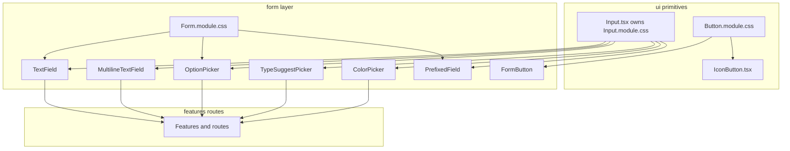

# UI component hierarchy and composition

## Principles

### React is the composition engine

Shared visuals are expressed by composing **components** and **`className` lists** (typically with `clsx`) in TypeScript/TSX. We do **not** use CSS Modules `composes` for reuse: it obscures dependency direction at build time and encourages the wrong mental model (e.g. generic controls “inheriting” from form-specific sheets).

### Strict dependency direction

More primitive / generic layers **must not** depend on more specific ones:

| Layer | Path | May import from |
|-------|------|-----------------|
| Primitives | `src/app/components/ui/**` | Other `ui` modules, shared tokens |
| Form | `src/app/components/form/**` | `ui`, shared tokens |
| Features / routes | e.g. `factions`, `routes` | `form`, `ui`, shared tokens |

**Forbidden:** `ui` importing from `form` or from feature folders.

### Role of CSS Modules

CSS Modules provide **scoped class names** and hook into design tokens (`var(--…)`). Prefer **one concern per class**; when an element needs “base + modifier” behavior, apply **multiple classes in TSX** (`clsx(base, modifier, local)`) instead of `composes`.

### Owning a CSS module (no cross-imports)

**Anti-pattern:** a component importing **`AnotherThing.module.css`** when that file “belongs” to another component or folder (e.g. a feature importing `ui/Input.module.css` directly). That hides the real API and scatters styling ownership.

**Do this instead:** import the **TSX primitive** that owns the stylesheet (e.g. `Input`, `Textarea`, `inputFieldClassNames` from [`Input.tsx`](../../src/app/components/ui/Input.tsx)), or import a **composed** control from `src/app/components/form/` (see below). Only the file that ships with the module should import `Input.module.css` (today: `Input.tsx`).

### Shared control styles

Low-level control chrome lives under **`src/app/components/ui/`** (e.g. `Button.module.css`, `Input.module.css`). **`Input.tsx`** is the sole importer of `Input.module.css` and exposes `Input`, `Textarea`, and `inputFieldClassNames` for cases that are not a raw `<input>` (e.g. prefixed shells, Radix triggers).

Form-specific layout and labels stay in `Form.module.css` and form components; they compose primitives in React—**without** importing `Input.module.css` themselves.

**`Input` `unstyled`:** use when the control sits inside another chrome (e.g. [`PrefixedField`](../../src/app/components/form/PrefixedField.tsx)) and local CSS removes borders/background so the outer shell provides the single border.

### Naming (form layer)

| Name | Role |
|------|------|
| `FormField` | Label, hint, error chrome around a child control (not a text box by itself). |
| `TextField`, `MultilineTextField`, `OptionPicker`, pickers | Composed field controls for product UI. |
| `PrefixedField` | Affix container (prefix/suffix) sharing one bordered “input” shell; children often use `Input` with `unstyled` or full `TextField` depending on layout. |
| `FormPrefixedInput` | Deprecated alias of `PrefixedField`; do not use in new code. |

### Standard form controls (composed API)

Prefer these exports from `src/app/components/form` for product UI:

| Component | Purpose |
|-----------|---------|
| `TextField` | Single-line text |
| `MultilineTextField` | Multi-line text |
| `OptionPicker` | Single choice from a list (Radix select) |
| `TypeSuggestPicker` | Combobox / typeahead (alias of the faction editor asset picker; same implementation) |
| `HexColorPicker` | Compact hex color control: swatch, popover (`react-colorful`), and hex text in a `PrefixedField` (app-wide; lives in `form/`) |
| `ColorPicker` | Full background color UI: solid vs gradient, stops, etc. (alias of `BackgroundColorSlot`; faction editor use case, but reusable) |
| `PrefixedField` | Prefix/suffix + shared border around the main control |

Modules colocated with those implementations (e.g. `FactionFormFields.tsx`) may import `AssetAutocomplete as TypeSuggestPicker` and `BackgroundColorSlot as ColorPicker` from `./` instead of the form barrel so the bundler does not create a circular chunk between `form/index` and the editor.

## Diagram

## Guardrails

- After changes, confirm there are **no** `composes:` declarations in project `*.css` files (`rg 'composes:' --glob '*.css'`).
- Optional: from `src/app` (excluding `src/app/components/ui`), `Input.module.css` should **not** appear in TSX—only `Input.tsx` imports it (`rg 'Input\.module\.css' --glob '*.tsx' src/app`).
- Optional: add Stylelint or CI checks to forbid `composes` in new CSS.
